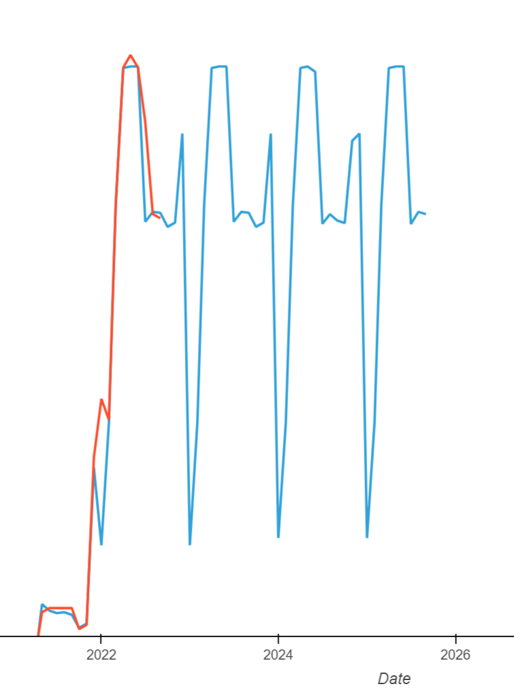
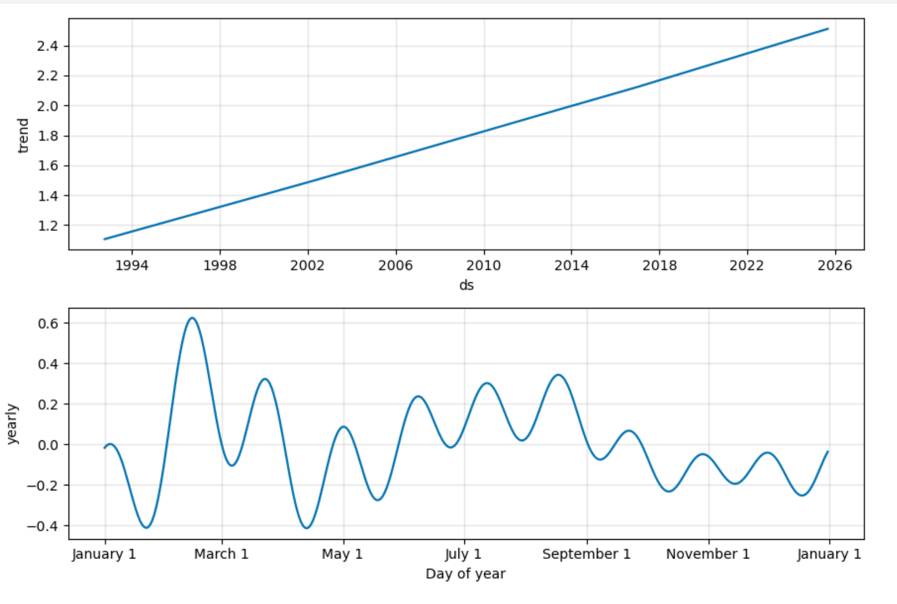
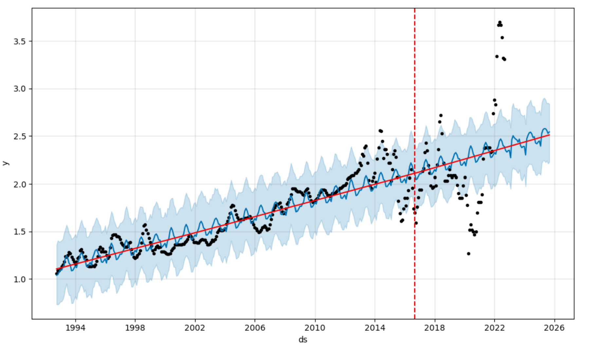
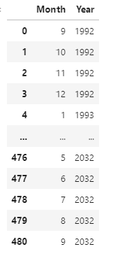
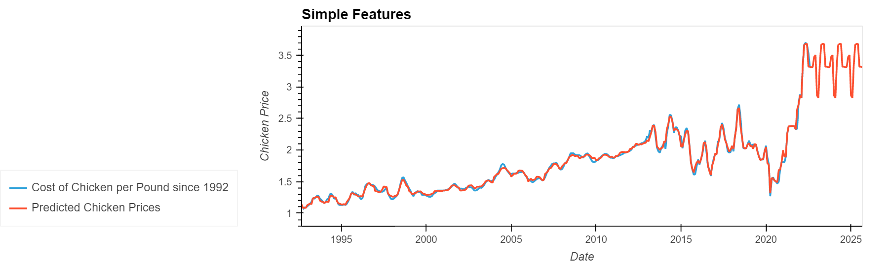
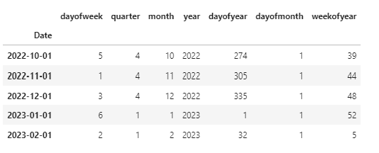
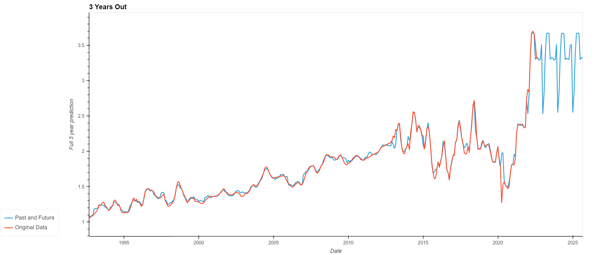

# Predicting Meat Futures
Assuming we are in a farming role we want to be able to predict the seasonality of chicken and potentially buy chicken futures when the prices are going to be the lowest. We also want to use both the Facebook Prophet time-series machine learning model and the XGBoost regression machine learning model to predict what the price will be in one year and three years.

## Technologies

Language: Python 3.7

Libraries used:

[Pandas](https://pandas.pydata.org/pandas-docs/stable/index.html) - For the creation and visualization of Data Frames

[Jupyter Labs](https://jupyter.org/) - An ipython kernel for interactive computing in python

[PyViz hvPlot](https://hvplot.holoviz.org/index.html) - A high level python library for interactive data visualization

[Scikit-Learn](https://scikit-learn.org/0.18/auto_examples/svm/plot_iris.html) - Powerful machine learning library

[Facebook Prophet](https://facebook.github.io/prophet/) - Industry gold standard for predicting time-series models

[XGBoost](https://xgboost.readthedocs.io/en/stable/) - Another industry standard machine learning tool similar to Random Forests 


## Installation Guide

If you are using an anaconda or a conda environment (which is highly recommended) chances are pandas, hvplot and jupyter labs are already installed in your virtual environment. In addition, installing Facebook's Prophet library will be necessary

For a full install activate a conda development environment and run in GitBash if not already installed, otherwise pip can be used:
```python
    conda install pandas
    conda install jupyterlab
    conda install -c pyviz hvplot
```

To install the other dependencies not included in the anaconda environment run:
```python
    conda install prophet
    conda install -c conda-forge py-xgboost 
    conda install -c intel scikit-learn
```

Check the to make sure everything has been installed properly
```python
    conda list pandas
    conda list hvplot
    conda list jupyter lab
    conda list prophet
    conda list xgboost
    conda list scikit-learn
```
---

## Pros and Cons of Prophet Compared to XGBoost

* XGBoost overfit the data 
* XGBoost did not weigh the increase in year heavy enough when creating predictions, does not pick up on increasing trend
* XGBoost kind of recognized a seasonality to the data, but it does not entirely line up with Prophet
* Prophet makes a reasonable looking predictive model for the future


---

## Similarities and Differences

**XGBoost picked up on some seasonality** - The peaks lie between months 4-6 and the dips are in January of each year
<div style="text-align: left"></div>

**Prophet** - Has a seasonality function built in to its software
<div style="text-align: left"></div>


---

## Summary of Predictions


---

### Prophet:
**Predictions 3 Years** <div style="text-align: left"></div>


### XGBoost:
**Simple Features:** <div style="text-align: left"></div><div style="text-align: left"></div>

**Mulitple Features:** <div style="text-align: left"></div><div style="text-align: left"></div>


## Collaborator Information

David Hutsell
> email: dhutsellcfncw@gmail.com |
> [Git Hub](https://github.com/dhut1621) |
> [LinkedIn](https://www.linkedin.com/in/david-hutsell-4b013795/) 

Ryan Svendson
> email: rsvendson@gmail.com |
> [Git Hub](https://github.com/RyanSvendson) |
> [LinkedIn](https://www.linkedin.com/in/ryan-svendson-cfp/)

Saidee Padilla
> email: SPadilla51@bigbend.edu |
> [Git Hub](https://github.com/saideepadilla) |
> [LinkedIn](https://www.linkedin.com/in/saidee-padilla-127684247/) 

Silvano Ross: 
> email: silvanoross3@gmail.com |
> [GitHub](https://github.com/silvanoross) |
> [LinkedIn](https://www.linkedin.com/in/silvano-ross-b6a15a93/)
